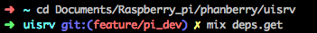

# Add new user

This is the firmware module, part of Phantaberry project, develop with Nerves framework in Elixir language.
It is intended to run on a Raspberry pi3 so `MIX_TARGET=rpi3`

## Targets

Nerves applications produce images for hardware targets based on the
`MIX_TARGET` environment variable. If `MIX_TARGET` is unset, `mix` builds an
image that runs on the host (e.g., your laptop). This is useful for executing
logic tests, running utilities, and debugging. Other targets are represented by
a short name like `rpi3` that maps to a Nerves system image for that platform.
All of this logic is in the generated `mix.exs` and may be customized. For more
information about targets see:

<https://hexdocs.pm/nerves/targets.html#content>

## Getting Started

### Necessary Applications and Plugins

##### MacOs:

1. Install homebrew. An useful plugin to instll applications and plugins from terminal.
2. Install Nerves. The required extension of the elixir language, the main language in this project.
3. Install SKM (An ssh keys manager). This will allow you to manage and create your public and private keys so no password is needed to acces the raspberry.
4. Install Oh My Zsh.
5. Instll ASDF plugin. This will allow you to install the elixir plugin.
6. Install Phoenix, another elixir project that will be useful in this poject.
7. It's a good idea to install sourcetree, allowing you to work on your projects more comfortably and allowing you to upload and download projects from GitHub more easily.

Once installed:
Using the skm tool create a key, it is important that you know where you placed this key because you'll need to share it with all the other users so that anyone can make new versions on the raspberry and all the authorised users can access.

Once you create the key you have to edit the code in the `/firmware/config/rpi3.exs` under line 27 the "authorised_keys: [ " you'll have to add another identical line but changing the path of the new key.

NOTE: this step can be done both ways, everyone having everyone's key, so when you put it into the raspberry it's got everyone's key so it will grant anyone with any of the keys access or it can be done having only one key that users would have to share.

When you have editted the lines of code go to the terminal and navigate to the folder `uisrv` and type the command 'mix deps.get'

Repeat the same operation but this time in the `firmware` folder, staying where you are write the command 'mix firmware', 

then insert the raspberry's SD card and write 'mix firmware.burn'.
Then place the SD back into the raspberry turn it on and let it install the new firmware. Once completed youwill be able to access the device wint any of the keys.

NOTE: you will have to select the new key as default.

