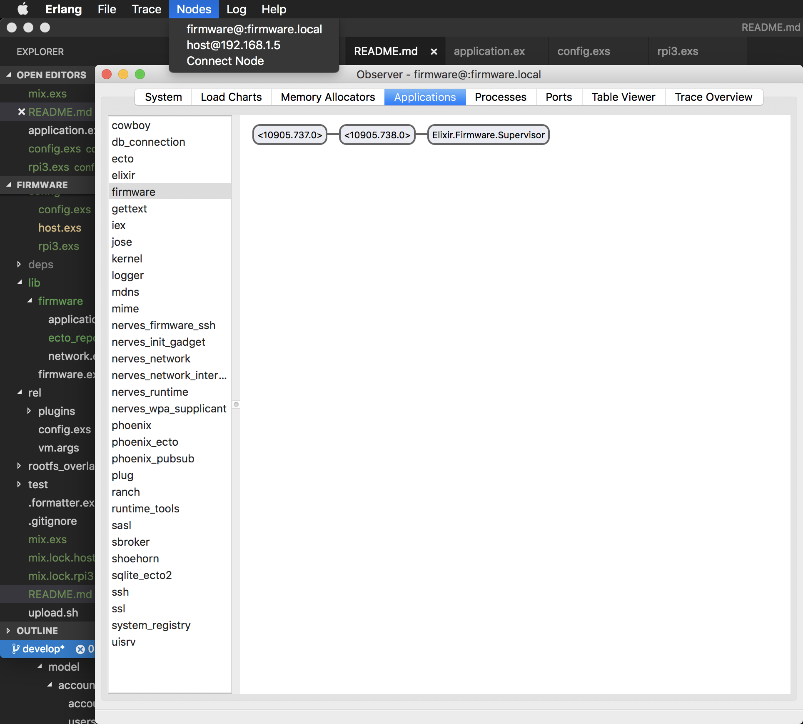

# Firmware

**TODO: Add description**

## Targets

Nerves applications produce images for hardware targets based on the
`MIX_TARGET` environment variable. If `MIX_TARGET` is unset, `mix` builds an
image that runs on the host (e.g., your laptop). This is useful for executing
logic tests, running utilities, and debugging. Other targets are represented by
a short name like `rpi3` that maps to a Nerves system image for that platform.
All of this logic is in the generated `mix.exs` and may be customized. For more
information about targets see:

https://hexdocs.pm/nerves/targets.html#content

## Getting Started

To start your Nerves app:
  * `export MIX_TARGET=my_target` or prefix every command with
    `MIX_TARGET=my_target`. For example, `MIX_TARGET=rpi3`
  * Install dependencies with `mix deps.get`
  * Create firmware with `mix firmware`
  * Burn to an SD card with `mix firmware.burn`

## mix release
```elixir
==> Packaging release..
Release succesfully built!
To start the release you have built, you can use one of the following tasks:

    # start a shell, like 'iex -S mix'
    > _build/rpi3/dev/rel/firmware/bin/firmware console

    # start in the foreground, like 'mix run --no-halt'
    > _build/rpi3/dev/rel/firmware/bin/firmware foreground

    # start in the background, must be stopped with the 'stop' command
    > _build/rpi3/dev/rel/firmware/bin/firmware start

If you started a release elsewhere, and wish to connect to it:

    # connects a local shell to the running node
    > _build/rpi3/dev/rel/firmware/bin/firmware remote_console

    # connects directly to the running node's console
    > _build/rpi3/dev/rel/firmware/bin/firmware attach

For a complete listing of commands and their use:

    > _build/rpi3/dev/rel/firmware/bin/firmware help
```


##Connet Observer to remote device 
At your localmachine start iex with applicatoin secret coockie locate in /rel/vm.args

```bash
iex --name host@192.168.1.5 \
    --cookie 'dHxfLOchtxkZIs+shDcAxNxkyNX9+Mjp1YjOWHZXELEeAidjbJvzHpOiwvjrf6oX'
Erlang/OTP 21 [erts-10.0.5] [source] [64-bit] [smp:8:8] [ds:8:8:10] [async-threads:1] [hipe]

Interactive Elixir (1.7.2) - press Ctrl+C to exit (type h() ENTER for help)
iex(host@192.168.1.5)1>
```

In the remote device ssh shell

```bash
iex(firmware@:firmware.local)16> Node.connect(:"host@192.168.1.5")
```

At your localmachine again

```bash
iex(host@192.168.1.5)3> Node.list
[:"firmware@:firmware.local"]
iex(host@192.168.1.5)4> :observer.start()   
```
And now yo can change nodes with the menu 

## RingLogger
Log messages aren't printed to the console by default. If you're seeing them,
they may be coming from Elixir's default `:console` logger.

To see log messages as they come in, call `RingLogger.attach()` and
then to make the log messages stop, call `RingLogger.detach()`. The
`attach` method takes options if you want to limit the log level, change the
formatting, etc.

Here's an example:

```elixir
iex> Logger.add_backend(RingLogger)
{:ok, #PID<0.199.0>}
iex> Logger.remove_backend(:console)
:ok
iex> RingLogger.attach
:ok
iex> require Logger
iex> Logger.info("hello")
:ok

14:04:52.516 [info]  hello
```

## Learn more

  * Official docs: https://hexdocs.pm/nerves/getting-started.html
  * Official website: http://www.nerves-project.org/
  * Discussion Slack elixir-lang #nerves ([Invite](https://elixir-slackin.herokuapp.com/))
  * Source: https://github.com/nerves-project/nerves
